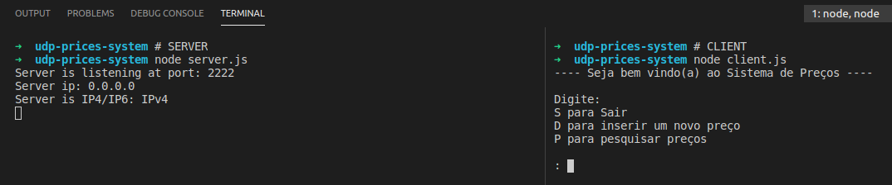
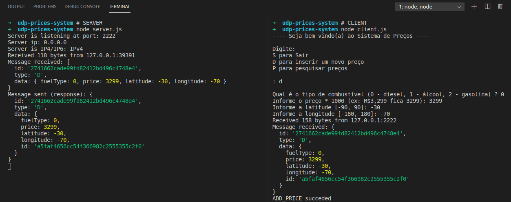
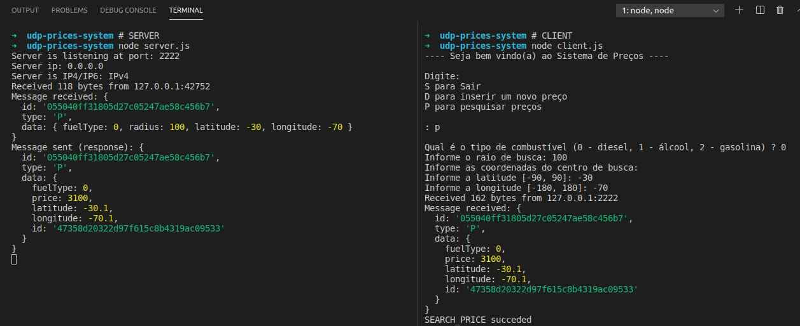

# Aplicação Cliente-Servidor - Sistema de Preços - Protocolo UDP

## Requisitos para execução

- Node

## Como usar ?

Abra um terminal e execute: `node server.js 2222`.

Depois abra outro terminal e execute: `node client.js localhost 2222`

## Problema a ser tratado

O trabalho consiste em desenvolver um sistema para enviar o preço de vários postos de combustíveis e requisitar o preço mais barato em uma dada região.

## Descrição técnica - servidor

### Classe `Observers`

Essa classe tem um papel muito importante, pois ela foi criada com o intuito de implementar um padrão de projeto de software chamado _Observer_. É um padrão que se encaixa perfeitamente com o recebimento e processamento de mensagens do UDP, pois só é possível identificar o tipo de uma mensagem após recebê-la e interpretá-la. Quando uma mensagem do UDP é recebida, todos os _observers_ (funções no meu caso) são executados, porém cada um checa o tipo da mensagem e decide se ela deve ser processada por ele ou não.

### Classe `Repository`

Essa classe tem a responsabilidade de gerenciar o arquivo de dados oferencendo métodos para inserção e busca.

### Classe `Messages` (`serverMessages.js`)

Essa classe tem a responsabilidade de fazer a integração entre a classe `Observers` e a classe `Repository`. Basicamente ela cria um _observer_ para cada tipo de mensagem que o cliente pode enviar e dentro desse _observer_ coloca a lógica necessária para prover ao cliente o que ele espera.

### Arquivo `serverMath.js`

Esse arquivo contém funções matemáticas para ajudar na busca do menor preço dentro de um raio.

### Arquivo `serverSocket.js`

Esse arquivo contém a criação do _socket_ do servidor e a definição da sua porta.

### Arquivo `server.js`

Esse é o arquivo principal do servidor. Ele tem a responsabilidade de definir as funções que serão executadas para cada evento relacionado ao _socket_ do servidor.

## Descrição técnica - cliente

### Classe `Observers`

Essa classe tem um papel muito importante, pois ela foi criada com o intuito de implementar um padrão de projeto de software chamado _Observer_. É um padrão que se encaixa perfeitamente com o recebimento e processamento de mensagens do UDP, pois só é possível identificar o tipo de uma mensagem após recebê-la e interpretá-la. Quando uma mensagem do UDP é recebida, todos os _observers_ (funções no meu caso) são executados, porém cada um checa o tipo da mensagem e decide se ela deve ser processada por ele ou não.

### Classe `Messages` (`clientMessages.js`)

Essa classe tem a responsabilidade de enviar as mensagens para o servidor e definir _observers_ para receber as respostas.

### Arquivo `clientSocket.js`

Esse arquivo contém a criação do _socket_ do cliente e a definição do _host_ e da porta do servidor.

### Arquivo `io.js`

Esse arquivo contém funções para leitura da entrada.

### Arquivo `input.js`

Esse arquivo contém funções para leitura da entrada, porém leituras relacionadas ao problema envolvido, ou seja, ler os dados do preço e da busca do preço.

### Arquivo `client.js`

Esse é o arquivo principal do cliente. Ele tem a responsabilidade de definir a interface com o usuário e definir as funções que serão executadas para cada evento relacionado ao _socket_ do cliente.

## Decisões de implementação

Há duas decisões importantes, ambas relacionadas às mensagens transferidas entre o cliente e o servidor:

- Escolhi usar o formato JSON para as mensagens.
- Toda mensagem é um objeto que contém pelo menos três atributos:
  ```ts
  type Message = {
    id: string; // Id da mensagem.
    type: "D" | "P"; // Tipo da mensagem, sendo que "D" e "P" se referem a inserção e busca de um preço.
    data: any; // Dados da mensagem. Equivalente ao body no HTTP por exemplo.
  };
  ```

## Testes

Interface inicial do servidor e do cliente:

</img>

Inserção de um preço:

</img>

Busca de um preço:

Após inserir estes dados no arquivo `dados.json`:

```json
{
  "prices": {
    "a5faf4656cc54f366982c2555355c2f0": {
      "fuelType": 0,
      "price": 3299,
      "latitude": -30,
      "longitude": -70,
      "id": "a5faf4656cc54f366982c2555355c2f0"
    },
    "47358d20322d97f615c8b4319ac09533": {
      "fuelType": 0,
      "price": 3100,
      "latitude": -30.1,
      "longitude": -70.1,
      "id": "47358d20322d97f615c8b4319ac09533"
    },
    "edac8bc189399818489470bc14903017": {
      "fuelType": 0,
      "price": 3200,
      "latitude": -30.2,
      "longitude": -69.8,
      "id": "edac8bc189399818489470bc14903017"
    }
  }
}
```

Esta é a resposta para a busca:

</img>

# Conclusão

A implementação usando UDP se mostrou interessante devido ao fato de que não é necessário estabelecer uma conexão antes de mandar os dados, você só informa o destino quando vai mandar o dado. Outro ponto muito bacana foi sem dúvida encontrar um projeto onde o padrão de projeto de software _Observer_ se encaixa perfeitamente. Além disso, ao fazer esse projeto percebi o porquê de existirem alguns padrões no protocolo HTTP como os métodos GET, POST, DELETE e outros.

# Bibliografia

- [_Node.js TCP client and server example_](https://gist.github.com/tedmiston/5935757)
- [_Simple UDP Client and Server in Node.js_](https://gist.github.com/sid24rane/6e6698e93360f2694e310dd347a2e2eb)
- [_Observer Pattern_](https://pt.wikipedia.org/wiki/Observer)
- [TCP](https://pt.wikipedia.org/wiki/Transmission_Control_Protocol)
- [TCP _vs_ UDP](https://pt.stackoverflow.com/questions/221860/o-que-%C3%A9-tcp-e-udp-qual-a-diferen%C3%A7a-entre-os-dois-protocolos#:~:text=O%20TCP%20preza%20pela%20confiabilidade,o%20envio%20direto%20de%20dados.)
- [_Function to calculate distance between two coordinates_](https://stackoverflow.com/questions/18883601/function-to-calculate-distance-between-two-coordinates)
